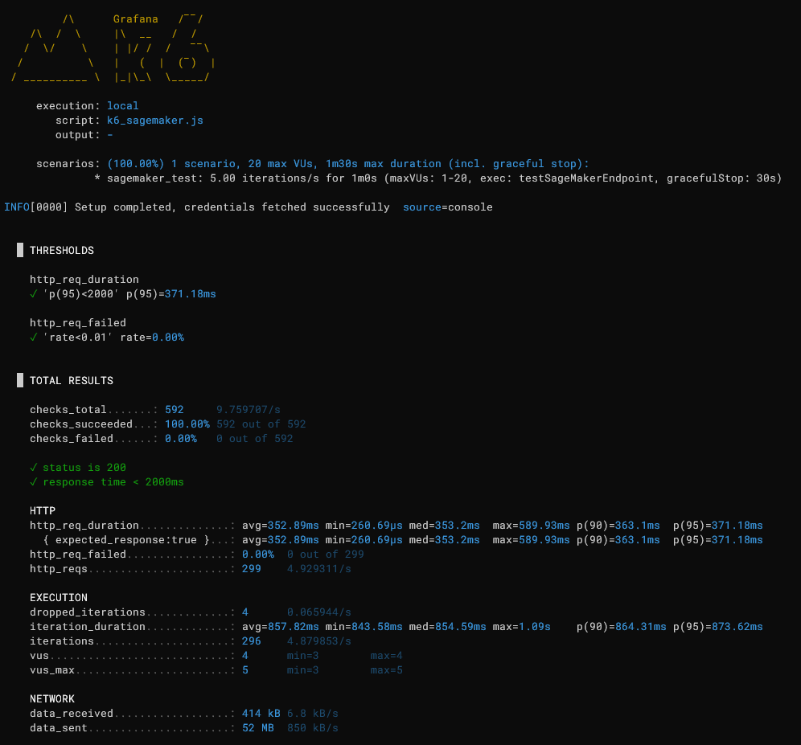
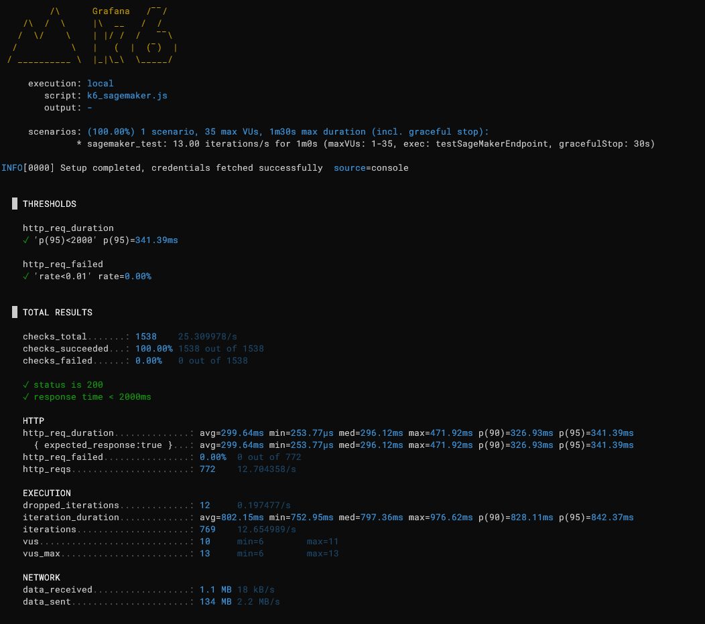
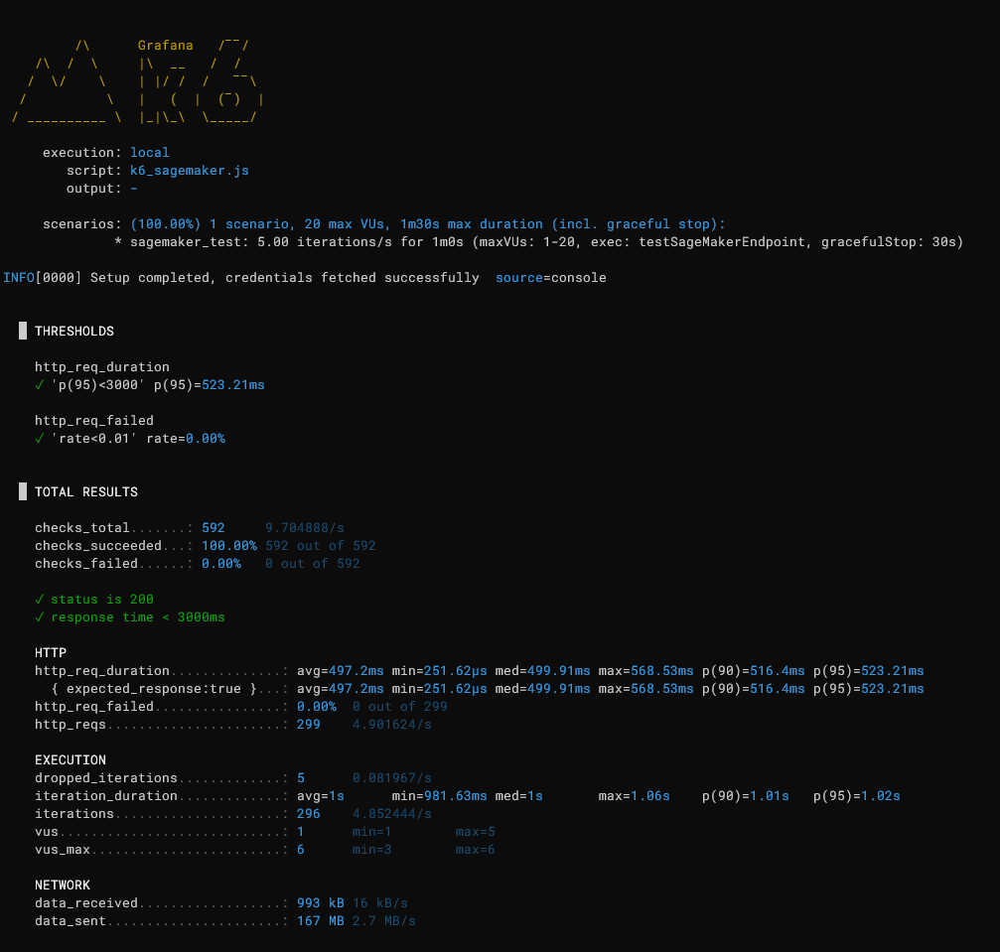
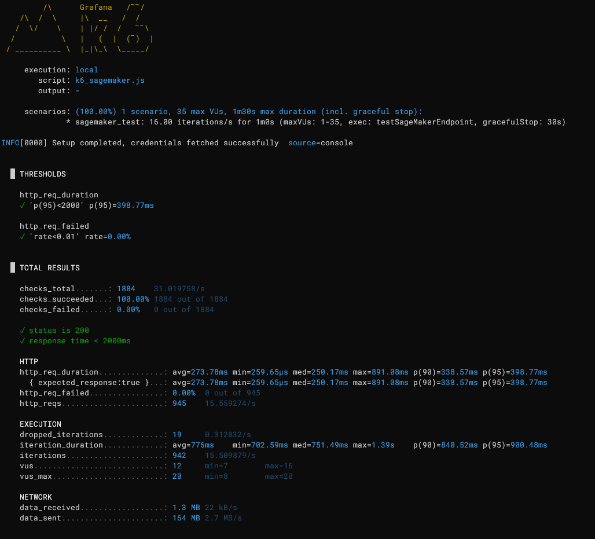
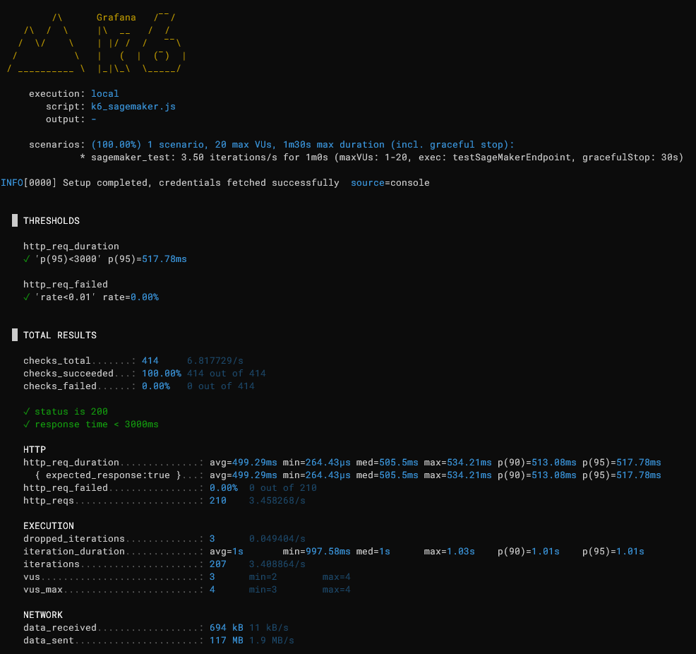

# SageMaker Endpoint Performance Test Results

This document presents the performance test results for Cochl.Sense Cloud API on various AWS SageMaker endpoint instance types.

## Test Environment

- **Test Tool**: [Grafana k6](https://k6.io/)
- **Test Duration**: 1 minute per scenario (with 30s graceful stop)
- **Region**: us-east-1 (test client and endpoint in the same region)
- **Endpoint Configuration**: Single instance (no auto-scaling)

## Test Scenarios

Two audio file lengths were tested for each instance type:
- **10-second audio file**: Simulates short audio processing
- **35-second audio file**: Simulates longer audio processing

**Note**: The RPS values in the results represent the **maximum sustainable load** for each instance type. These are the highest throughput values achievable while maintaining 100% success rate and stable latency.

## Results Summary

| Instance Type | Audio Length | Max RPS | Avg Latency | p(95) Latency | Success Rate |
|:---|:---:|:---:|---:|---:|:---:|
| ml.g4dn.xlarge | 10 sec | 5 | 352.89 ms | 371.18 ms | 100% |
| ml.g4dn.xlarge | 35 sec | 1.5 | 867.90 ms | 908.55 ms | 100% |
| ml.g5.xlarge | 10 sec | 13 | 299.64 ms | 341.39 ms | 100% |
| ml.g5.xlarge | 35 sec | 5 | 497.20 ms | 523.21 ms | 100% |
| ml.g6.xlarge | 10 sec | 16 | 273.78 ms | 398.77 ms | 100% |
| ml.g6.xlarge | 35 sec | 3.5 | 499.29 ms | 517.78 ms | 100% |

## Detailed Results by Instance Type

### ml.g4dn.xlarge

#### 10-second Audio File (5 RPS)

- **Max RPS**: 5 iterations/s
- **Max VUs**: 20
- **Total Requests**: 299
- **Avg Latency**: 352.89 ms
- **p(95) Latency**: 371.18 ms
- **Success Rate**: 100%

#### 35-second Audio File (1.5 RPS)

- **Max RPS**: 1.5 iterations/s
- **Max VUs**: 10
- **Total Requests**: 91
- **Avg Latency**: 867.90 ms
- **p(95) Latency**: 908.55 ms
- **Success Rate**: 100%

---

### ml.g5.xlarge

#### 10-second Audio File (13 RPS)

- **Max RPS**: 13 iterations/s
- **Max VUs**: 35
- **Total Requests**: 772
- **Avg Latency**: 299.64 ms
- **p(95) Latency**: 341.39 ms
- **Success Rate**: 100%

#### 35-second Audio File (5 RPS)

- **Max RPS**: 5 iterations/s
- **Max VUs**: 20
- **Total Requests**: 299
- **Avg Latency**: 497.20 ms
- **p(95) Latency**: 523.21 ms
- **Success Rate**: 100%

---

### ml.g6.xlarge

#### 10-second Audio File (16 RPS)

- **Max RPS**: 16 iterations/s
- **Max VUs**: 35
- **Total Requests**: 945
- **Avg Latency**: 273.78 ms
- **p(95) Latency**: 398.77 ms
- **Success Rate**: 100%

#### 35-second Audio File (3.5 RPS)

- **Max RPS**: 3.5 iterations/s
- **Max VUs**: 20
- **Total Requests**: 210
- **Avg Latency**: 499.29 ms
- **p(95) Latency**: 517.78 ms
- **Success Rate**: 100%
