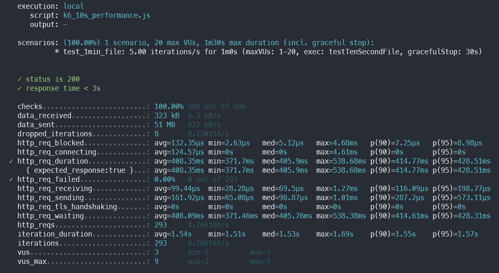
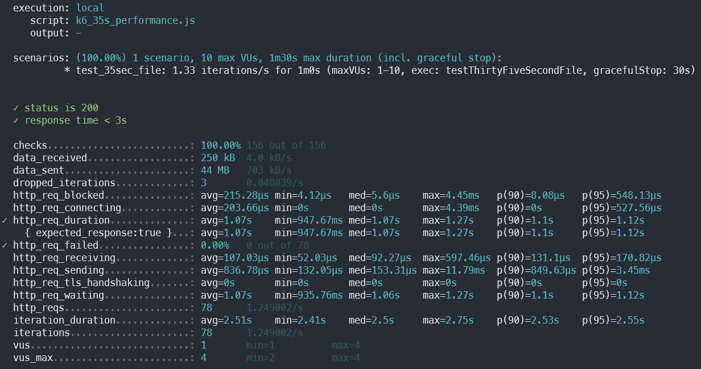
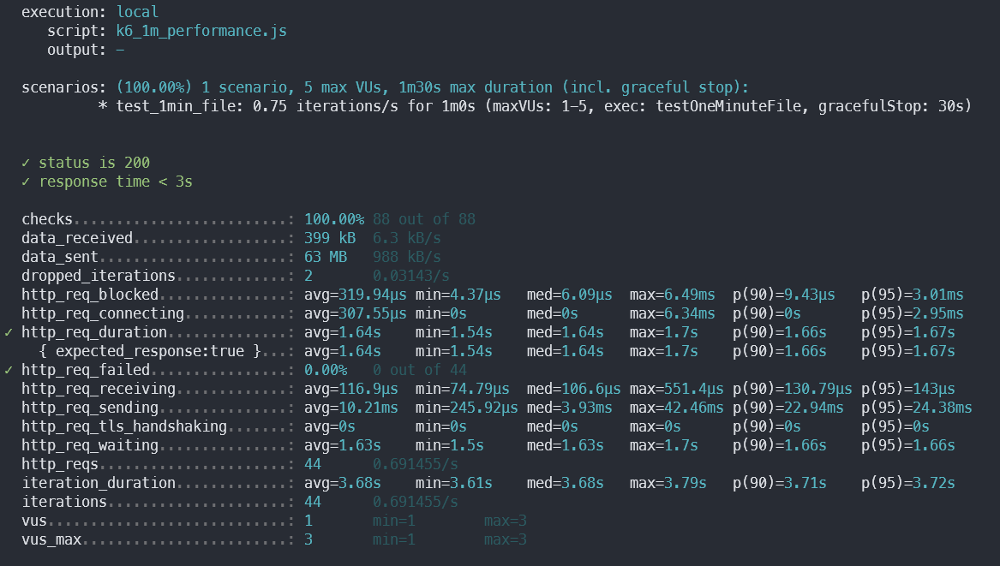
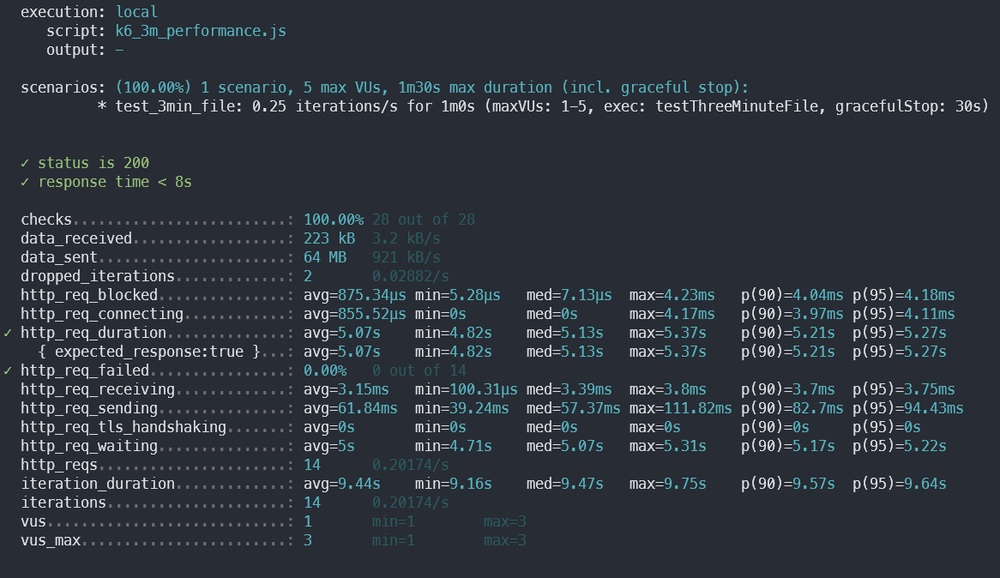

# Performance TEST

| **Spec**       | **Details**              |
|-----------------|--------------------------|
| **Instance Type** | `n1-standard-2`          |
| **vCPUs**       | 2                        |
| **Memory**      | 7.5 GB                   |
| **GPU**         | `NVIDIA T4` (1 unit)     |

## Test result

The test was done using the k6 tool, and we checked the maximum number of requests the system can handle without any issues.

### 10 seconds file

- Max: 5 req / sec  
  

### 35 seconds file

- Max: 1.33 req / sec  
  

### 60 seconds file

- Max: 0.75 req / sec  
  

### 180 seconds file

- Max: 0.25 req / sec  
  

